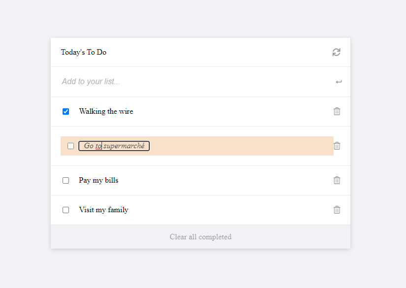

# Testing To Do list: Part 2

In this part of the testing project, you will test functions responsible for the status and content updates. You will also test the order re-position of items in the list upon drag/drop actions.

 

## Live Demo

[Live Demo Link](https://codecaiine.github.io/todo-list-app/)
 
## Built 
- HTML
- CSS
- Javascript
- Webpack 
- HTML&CSS Linter
- Git

## Get Started

Please get your browser update.
To get a local copy up and running follow these simple steps.

Run the command below from the Terminal:

.  Open your terminal or command line
.  Run git clone and paste the link
.  Open the folder with your code editor
.  Create a branch to work on
.  Run npm install
.  Run npm run build
.  Run npm run start to launch the server.
.  Run npm run test to run the test cases.

## Authors

👤 **Yannick-Noel AKA**

- Location: Côte d'Ivoire
- GitHub: [@codecaiine](https://github.com/codecaiine)
- Twitter: [@yannicknaka](https://twitter.com/yannicknaka)
- LinkedIn: [LinkedIn](https://www.linkedin.com/in/yannick-no%C3%ABl-aka/)

👤 **Kossi-Stack**

- Location: Togo
- GitHub: [@githubhandle](https://github.com/Kossi-stack/Mobile_Version_Skeleton)
- LinkedIn: [LinkedIn](https://www.linkedin.com/in/kossifioklou2406/)

## 🤝 Contributing

Contributions, issues, and feature requests are welcome!

Feel free to check the [issues page](https://github.com/codecaiine/todo-list-app/issues).

## Show your support

Give a ⭐️ if you like this project!

## Acknowledgments

- Thanks to Microverse
- Kossi Fioklou
- Yannick AKA
- Adedamola Shittu
- Zeenat Lawal

## 📝 License

This project is [MIT](./MIT.md) licensed.
